# Ribbit online Discussion forum

[View the live project here.](https://ribbit-2022.herokuapp.com/)

Ribbit is a discussion website where users can post and discuss about whatever they want.
People can find new information, inspiration and people.

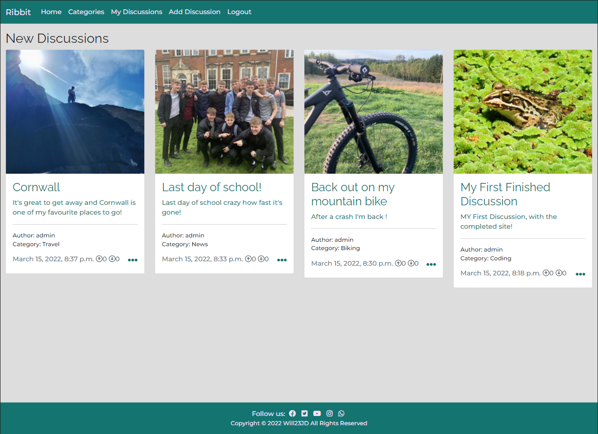

## Index 

* <a href="#ux">User experience (UX)</a>
* <a href="#design">Design</a>
* <a href="#wireframes">Wireframes</a>
* <a href="#agile">Agile</a>
* <a href="#features">Features</a>
* <a href="#testing">Testing</a>
* <a href="#technologies">Technologies used</a>
* <a href="#deployment">Deployment</a>
* <a href="#credits">Credits</a>
* <a href="#acknowledge">Acknowledge</a>

## User Experience (UX)

## Project goals:

* To make a fully functioning website where users can discuss whatever they like.
* Allow users full control over their discussion, with options to edit and delete.
* Users can up and down vote discussions and create comments.

## User stories:

### As a site user:
* I want to be able to read discussion and comments
* I want to be able to filter by a category

### As a registered site user:
* I want to be able to create my own discussions
* I want to be able to comment on other discussions
* I want to be able to up or down vote a discussion
* I want to be able to edit my discussions
* I want to be able to delete my discussions
* I want to be able to edit or delete my comments

### As the site admin in need to:
* Be able to manage all discussions and comments
* Be able to edit categories
* Be able to add futher categories
* Be able to delete discussions, comments, categories and users

## Design

### Imagery
* Images are able to be uploaded by registered users.
There is no theme, or stlye however if a user doesn't choose an images\
a basic frog is displayed to fill the space.

### Colour Scheme
* I used a mix of green throughout the page to stick with the theme
of a frog(hence the name Ribbit)

### Typography 
* For my body and p elements, I used: [Montserrat](https://fonts.google.com/specimen/Montserrat)
with a weight of 500. As this is a clean and easie to read font

* For the head elements, I used: [Raleway](https://fonts.google.com/specimen/Raleway) with a 
weight of 400 as this again was a clean font.

## Wireframes 

* Home page

    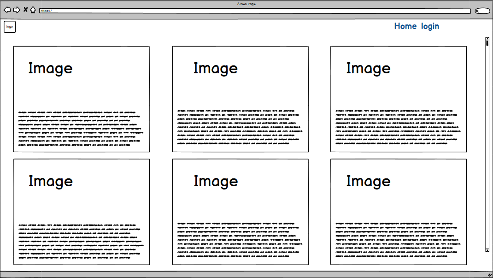

* Opened discussion

    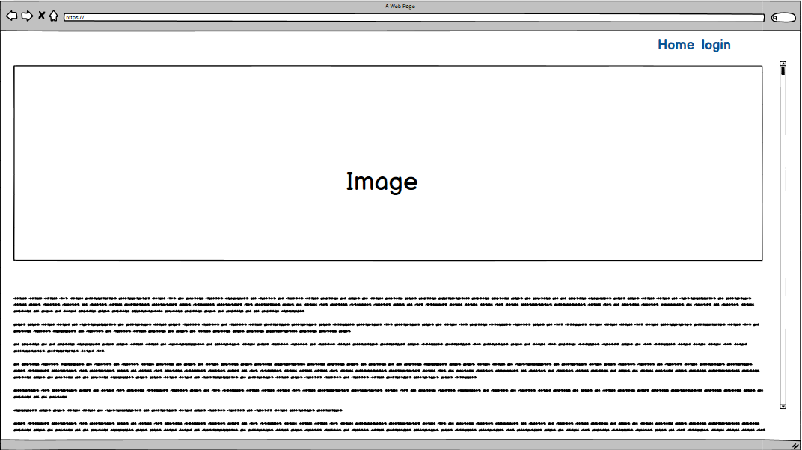

* View on phones and tables

    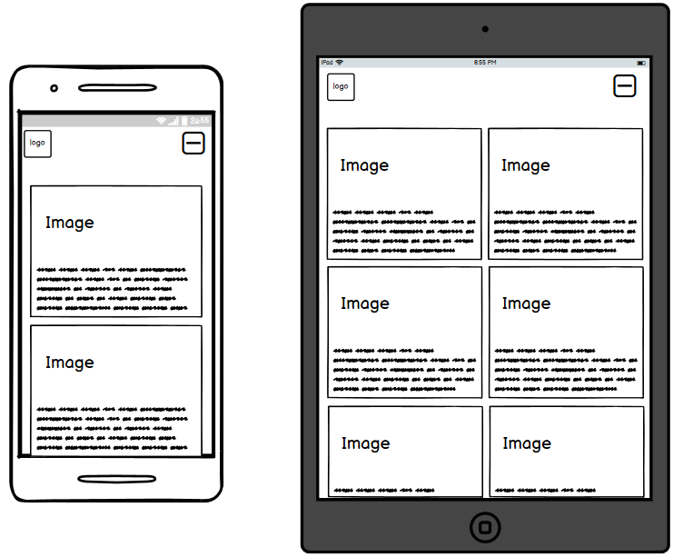

* Sign in page

    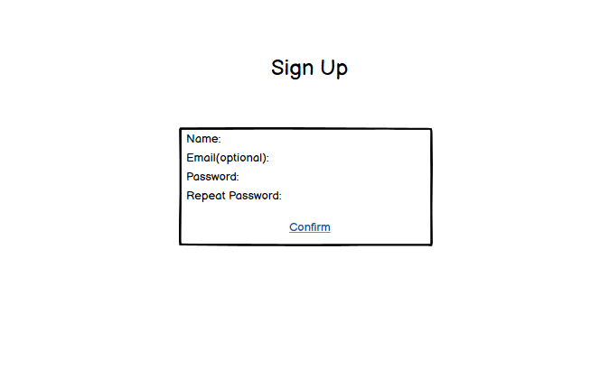

## Flow chart

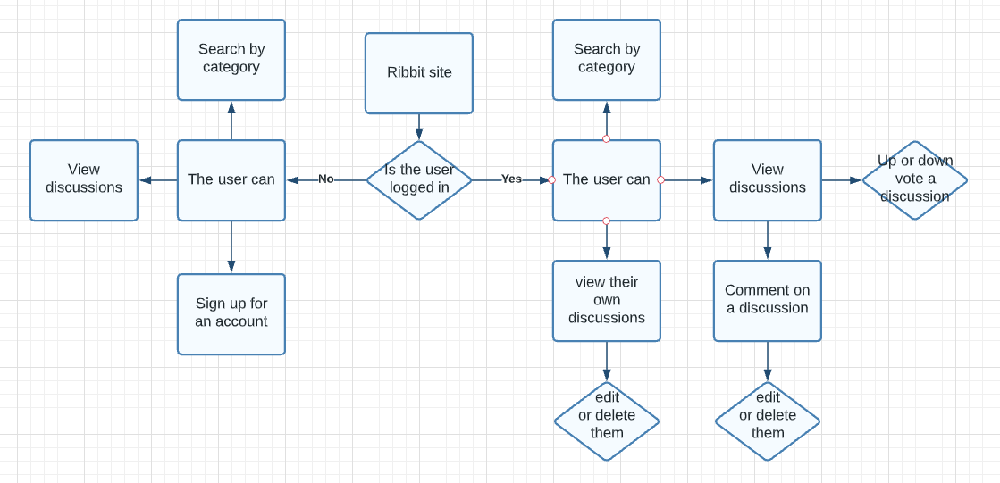
* How the user can use the site if the are signed it or not

## User stories

### Issues
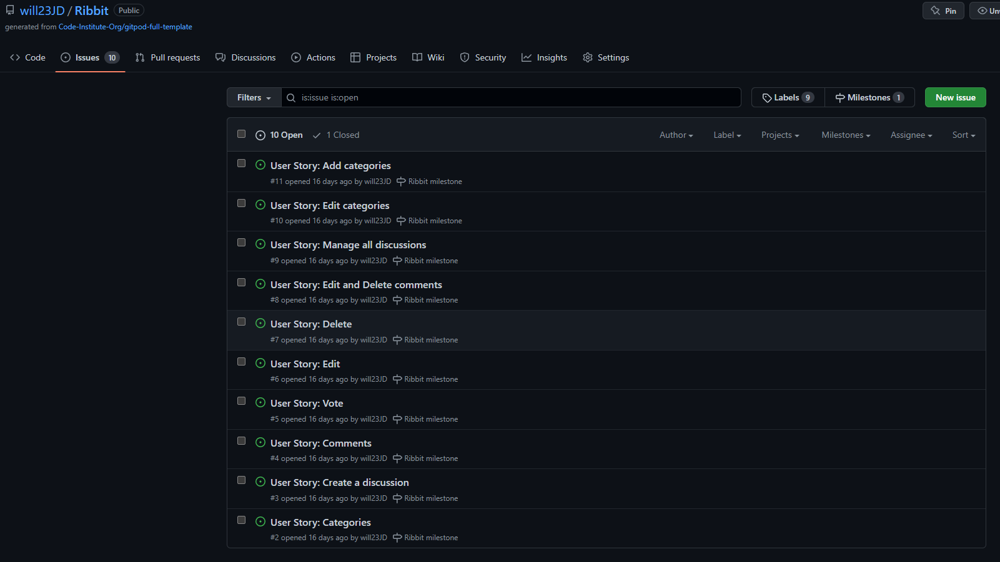
Issues this aglie tool allows for user stories to be easily added to the project and creates a clear idea of what needs to be done to implement the feature.

### Milestone
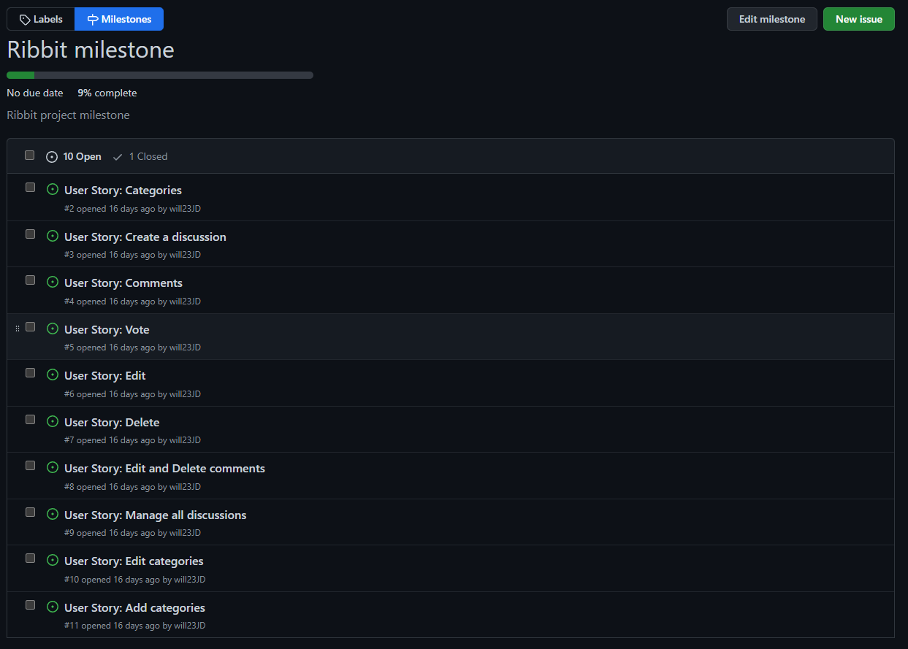
After creating issues they can be sorted into milestones, this allows to see the current porgress on the issues and close them with comments. This is useful
as it allows you to keep an on track with the projects release date.

## Burndown Chart
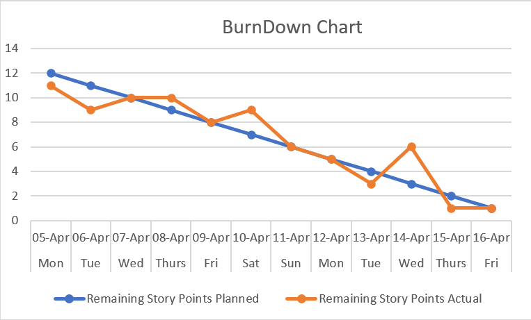
* This agile tool allows me to see if im on track to complete the current interation on time by comparing the current complete story points vs the planned points. 

## Features

### Navigation:

#### Nav

* On the Nav bar you are able to go back to the home page, view by category and if you are signed in you can:
    * Create a new discussion and logout.
* If you aren't signed in you can login or sign up for an account.

#### Footer

* The footer doesn't change based on if you are signed or not, and it contains links to social platforms and copyright.

### Home page (index.html):

#### Discussion cards

* The card is general information about the discussion, which contains:
    * featured image
    * title and exsert
    * author and category
    * date of creation and up and down votes
* The aim of the card is to give users an idea about the discussion before they click on it.

#### Pagination
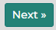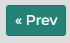
* The page paginate a 12 cards to stop user having to scroll for a long time.

### Opened discussion
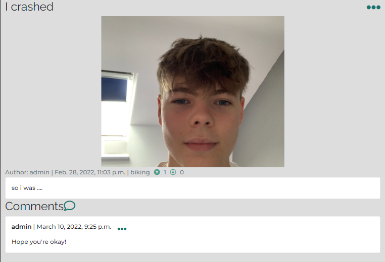
* At the top of the page is the title of the discussion
* Following this is is the feature image, if the user doesn't us a picture nothing will be displayed.
* After this is the general information about the post like: author, creation, up and down votes.
* Next is the body/main area for the discussion.
* Last is the comment section, where you can read other peoples comments and comment yourself.

### View by category
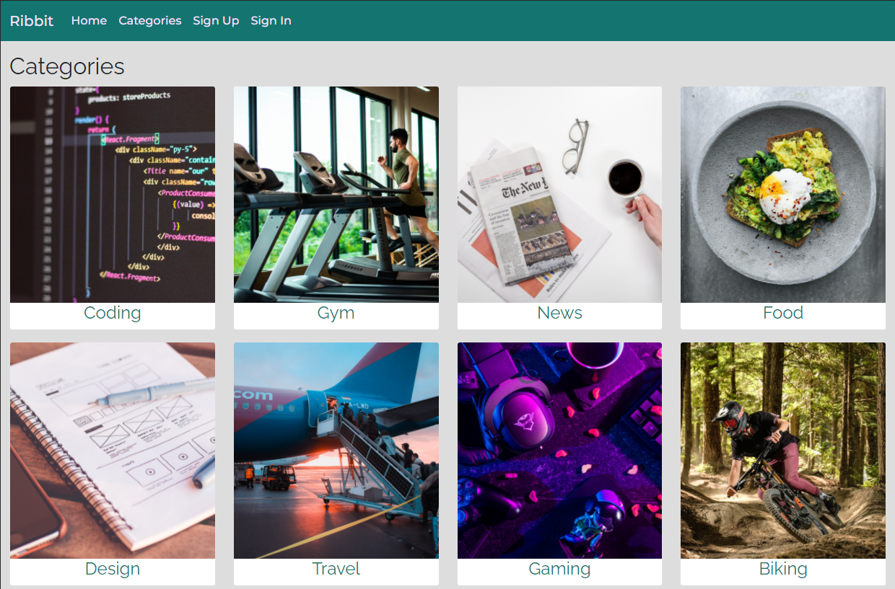
* The category page allows user's to view post by there category.
* This can make it easier for user's to find discussions they are interested about.
* The categories are displayed in the same way as the home page in order to keep a consistant style
and make it easy for the user to navigate through.

### Your discussions
* Having a separate page for all your discussion makes it easier to find, edit and delete 
them, this is important because a user doesn't want to have to scroll though other 
discussion in order to get the theirs.

### Editing and deleting your comments and discussions
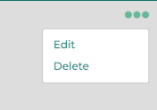

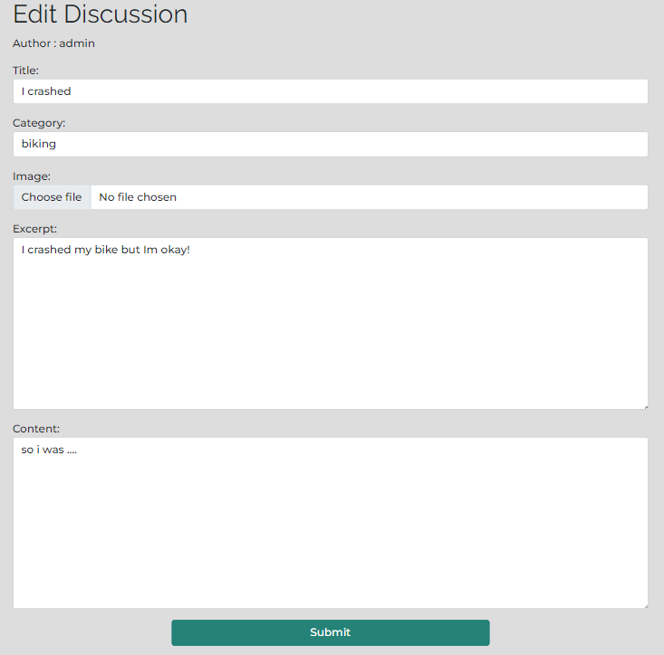

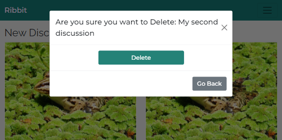
* Being able to edit or delete a discussion or comment is important as a user 
may need to update a discussion to contain new/ correct information.

### Adding a discussion
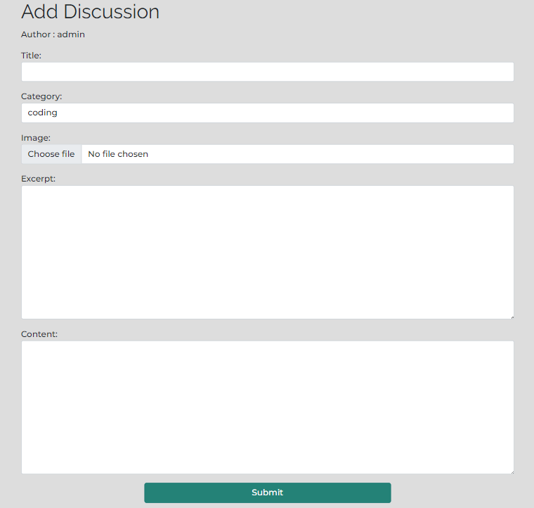
* As a Login user, if want to make a discussion I should have a clean simple way to do so.
That's why adding a discussion is right on the nav bar and opens a simple form for users to create their discussion about whatever they want.

### login/out and sign up
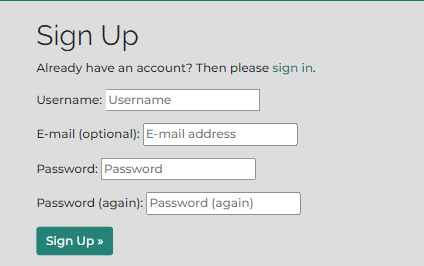
* The sign up and and other pages have a simple clean look in order to keep it easy to get logged in or sign up.

### Potential Features
* More filters such as:
    * Number of votes
    * Discussions you have liked
* A search box to look for a specific disussion
* User profile page

## Testing

### Web browers
* When testing in different browers I wanted to make sure all feature and style look and functioned the same. This is important so that the user can have the same experience on any different brower. I tested that the page opens and works in browsers: Chrome, Edge, Firefox,and Bing. To test the different browsers I used my computer to test Chrome, Edge, Firefox, and bing

### Responsiveness
* I tested that this project is responsive, keeps a consistent style, function as intended and looks good on all screen sizes. To make sure my site worked on different devices I loaded the page on an iphone XR, 13" laptop, 15" laptop and my PC which is displaying to a 24" monitor. To test my site on my screen sizes I didn't have I used dev tools. 

### Testing user stories 

### As a site user:
* I want to be able to read discussion and comments
    * As a site user I can read discussions and comments by: clicking on any discussion title or excerpt I wish to open.
* I want to be able to filter by a catagory
    * As a site user I can filter by a category by: clicking on the categories table at the top of the page and selecting the category I wish to filter by.

### As a registered site user:
* I want to be able to create my own discussions
    * As a registered user I can create my own discussions by: clicking on the create a discussion on the nav bar which brings out a form to create my discussion.
* I want to be able to comment on other discussions
    * As a registered user I am able to comment on other discussions and my own by: clicking the speech bubble icon at the end of the discussion allowing me to write a comment.
* I want to be able to up or down vote a discussion
    * As a registered user I can up or down vote a discussion by: clicking on the up or down arrow before the discussion body.
* I want to be able to edit my discussions
    * As a registered user I can edit my discussions by: clicking the 3 dots at the bottom right of an unopened discussion or the top left of an opened one and pressing edit.
* I want to be able to delete my discussions
    * As a registered user I am able to delete my discussions by: clicking the 3 dots at the bottom right of an unopened discussion or the top left of an opened one and clicking delete and the confirming the pop up modal.
* I want to be able to edit or delete my comments
    * As a registered user I can delete and edit my comments by: clicking the 3 dots at the end of the comment and pressing edit or delete.

### As the site admin in need to:
* Be able to manage all discussions and comments
    * As the site admin I am able to manage all discussions and comments in the admin panel by: login on to the admin panel and clicking on discussion > discussions or comments > then clicking what you want to manage.
* Be able to edit categories
    * As the site admin I am able to update discussions, comments and categories by: login on to the admin panel and clicking on discussion > categoryss(wrong spelling on the model) > then on the category you wish to edit.
* Be able to add futher categories
    * As the site admin I am able to add more categories by: login on to the admin panel and clicking on discussion > categoryss and clicking add category in the top right.
* Be able to delete discussions, comments, categories and users
    * As the site admin I am able to delete discussions, comments, categories and users by: login on to the admin pannle and clicking discussion > then the area in which you want to delete something(discussions) > then on the discussion you want to delete
    then clicking delete at the bottom of the page and confirming. To delete users click on users under authentication and authorization then clickin on the user you wish to delete and clicking delete at the bottom of the page and confirming.

### Validator Testing

* HTML
    * No errors were found when passing through the [official W3C validator](https://validator.w3.org/#validate_by_input).

* CSS
    * No errors were found when passing through the [official (Jigsaw) validator](https://jigsaw.w3.org/css-validator/#validate_by_input).

* Javascript
    * No errors were found when passing through the [JSHint validator](https://jshint.com/).

* Python 
    * No errors were found when passing through the [PEP8 validator](http://pep8online.com/).
    * (Only lines to long which as been a long stanting issue with django and pep8)

* Accessibility
    * I used lighthouse to confirm the site accessibility was as high as possible.

### Defensive design

#### Python

1. The signup form: 
    * The user must input a user name
    * The users password must  contain at least 8 characters and the password is not too common.
**This is accomplished using allauth and its built in validation**
        
2. Adding a discussion:
    * The user must be sign in
    * The discussion must have a title that is unique.
    * The discussion must contain Content.
**The user is checked using djangos built in **
**This discussion requirements are set in the discussion class in the models.py file**

3. Edit and delete a discussion or comment:
    * The discussion or comment must have been created by the user in order for them to be able to edit or delete them.
**The user is checked using djangos built in **

4. Deleting
    * Nothing can be deleted in one click.
**This is done using a model from bootstrap that is activated when a user tries to delete something**

5. Up or down voting a discussion
    * The user must be signed in
    * The user can only up or down vote a discussion
**This is done with True and Flase statments in the views.py file**

#### JavaScript
As there is not much JavaScript code in this project manual test have been used to assess functionality.

1. Copyright script in the footer:
    * The footer displays the right date.

2. Message pop up script:
    * This after performing any CRUD opperation a message displays at the top of the screen and removes itself after 4 seconds.

3. Let author = {{use.id}} script on add, edit discussions and add comments. 
    * This allows allows the users name to be passed to the form in order to keep the user from editing the author. I've
    tested this function work on all forms.

### Fixed Bugs 
* When Adding an email to the sign up form it would cause a 500 error.
    * Fixed by adding: EMAIL_BACKEND = 'django.core.mail.backends.console.EmailBackend'
                      ACCOUNT_EMAIL_VERIFICATION = "none"
    to settings.py
* Delete modal would cause padding to be added to the right side of the screen.
    * Fixed by adding: padding-right: 0 !important to styles.css

### Unfixed Bugs
* None

## Technologies Used

### Languages Used
* [HTML5](https://en.wikipedia.org/wiki/HTML5)
* [CSS3](https://en.wikipedia.org/wiki/CSS)
* [Javascript](https://en.wikipedia.org/wiki/JavaScript)
* [Python](https://www.python.org/)

### Framework, Libraries and Programs used
* [Django](https://www.djangoproject.com/)

* [Allauth](https://django-allauth.readthedocs.io/en/latest/installation.html)

* [Gunicorn](https://docs.djangoproject.com/en/4.0/howto/deployment/wsgi/gunicorn/)

* [Cloudinary](https://cloudinary.com/home-3722)

* [PostgreSQL](https://www.postgresql.org/)

* [Summernote](https://summernote.org/)

* [Heroku](https://www.heroku.com/home)

* [Gitpod](https://www.gitpod.io/)

* [Git](https://git-scm.com/)

* [GitHub](https://github.com/)

* [Balsamiq](https://balsamiq.com/wireframes/)

* [Lucidchart](https://www.lucidchart.com/)

* [Google Fonts](https://fonts.google.com/)
 
* [Font Awesome](https://fontawesome.com/)

## Deployment

**Important**
* Due to security issue Heroku had disabled deployments from GitHub so in order to deploy the project you must do so within Gitpod.
1. Open the terminal.
2. Log in to Heroku and enter your details.
    * Enter the following command in the terminal: heroku login -i
3. Get your app name from Heroku.
    * Enter the following command in the terminal: heroku apps
3. Set the Heroku remote. (Replace <app_name> with your actual app name and remove the <> characters)
    * Enter the following command in the terminal: heroku git:remote -a <app_name>
4. Add and commit any changes to your code, if applicable.
    * Enter the following command in the terminal: git add . && git commit -m "Deploy to Heroku via CLI"
5. Push to both GitHub and Heroku
    * Enter the following command in the terminal: git push origin main
    * Enter the following command in the terminal: git push heroku main

### Django and suporting libaries
1. In a new workspace in the terminal type: pip3 install django gunicorn
2. Libaries need for PostgreSQL: pip3 install dj_database_url psycopg2
3. Create requirments.txt: pip3 freeze --local > requirments.txt
4. Create a new django project: django-admin startproject pojectname .
5. Create a new django app: python3 manage.py startapp appname
6. Add your new app the the projects installed apps: projectname > settings.py > scroll to INSTALLED_APPS > add 'appname', to the list
7. save the file
8. Now back to the terminal to migrate the changes: python3 manage.py migrate
9. Run your project: python3 manage.py runsever
10. And you're up and running just like that!
### Heroku App
1. Create a new app on heroku
2. Head to the resources tab on your new heroku app
3. In the add-ons box search: Heroku Postgress and add it to your project
4. Now head to your settings tab and click on Reveal Config Vars
4. Copy the DATABASE_URL and head back over to your project
5. In the same level as your project create an env.py file (Remeber to add this to your .gitignore)
6. In env.py import os
7. Then: os.environ["DATABASE_URL"] = "Your copied DATABASE_URL"
8. After that create your secret key: os.environ["SECRET_KEY"] = "Your random secret key"
9. Save the file and then copy the secret key
10. Back at your heroku app Config Vars add the key: SECRET_KEY and the value: Your copied secret key
11. Back in your projects settings.py file under the first import
12. import os, import dj_database_url
13. The add the if statement: if os.path.isfile('env.py'):
                                    import env
14. Now just under that replace the insercure key and replace it with = os.environ.get('SECRET_KEY')
### postgreSQL
1. In setting.py file scroll down to the Database section and comment it out
2. Then type: DATABASES = {
    'default': dj_database_url.parse(os.environ.get('DATABASE_URL'))
}
3. Now back to the terminal and run the migrate again:(python3 manage.py migrate)
### Cloudinary
1. Create a Cloudiary account(if you dont have one all ready)
2. Copy your API Environment variable:
3. Now back to your env.py file:
os.environ["CLOUDINARY_URL"] = "copied API key"(make sure you remove the CLOUDINARY_URL from that start of the key)
4. Copy the key again and head back over to your heroku app
5. Add a new Config Var: key= CLOUDINARY_URL value=copied api key
6. Add new another Config Var: key=DISABLE_COLLECTSTATIC value=1 (This is to get the project deploying as we dont have any static files yet)
7. Back to the settings.py file, INSTALLED_APPS add: 'cloudinary_storage'(just above 'django.contrib.staticfiles'), 'cloudinary'
8. Now near the bottom of the file under STATIC_URL = '/static/' add:
STATICFILES_STORAGE = 'cloudinary_storage.storage.StaticHashedCloudinaryStorage'
STATICFILES_DIRS = [os.path.join(BASE_DIR, 'static')]
STATIC_ROOT = os.path.join(BASE_DIR, 'staticfiles')

MEDIA_URL = '/media/'
DEFAULT_FILE_STORAGE = 'cloudinary_storage.storage.MediaCloudinaryStorage'
### Templates
1. Back at the top of the settings.py file under BASE_DIR add:
TEMPLATES_DIR = os.path.join(BASE_DIR, 'templates')
2. Then in the middle of the file in TEMPLATES change the 'DIRS':[TEMPLATES_DIR],
### Allowed hosts
1. In the settings.py file in ALLOWED_HOSTS and ['your heruko appname.herukoapp.com', 'localhost']
2. Now on the top level of your project create 3 folder: media, static and templates
3. Then create a file named Procfile
4. In the Procfile add the line: web: gunicorn ribbit.wsgi
### Deploy 
1. First In your terminal: git add .
                           git commit -m 'Deploy'
                           git push
2. Now back to heroku and click on the deploy tab
3. Deployment method: GitHub (Connect you account id you haven't already)
4. Search for you project repo and connect it
5. Scroll to the bottom of the page and click deploy.
6. Then click on open app and you're Done! 

### Forking the GitHub Repository

Forking the repository allows us to have a copy of the original repository to view and make changes on our GitHub account with affecting to original work. Forking a repository can be done with the following steps.

1. Log in to GitHub and locate the [GitHub Repository](https://github.com/will23JD/Ribbit)
2. At the top right of the repository above settings, find and click the fork button. 
3. You will now have a copy in your account.

## Credits

### Code 
* [Codemy](https://www.youtube.com/channel/UCFB0dxMudkws1q8w5NJEAmw)
    * Help with displaying discussion, custom forms and add discussion page.
* [CodeInstitue](https://codeinstitute.net/)
    * Help from think before I blog walk through: Setting django app up, deploy to
    heroku, cloudinary, basic stlyes and allauth.
* [Stack overflow](https://stackoverflow.com/)
    * Help with various bugs
* [Pexel](https://www.pexels.com/)
    * source of all stock images.

### Acknowledgements

* My Mentor for feedback throughout the project.
* Friends and family for help with testing and feedback