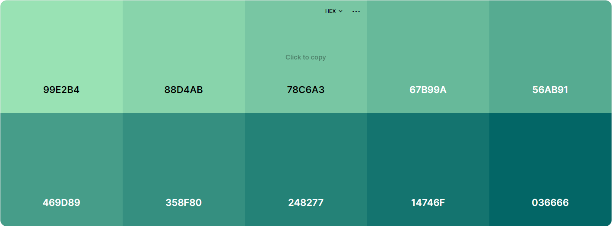
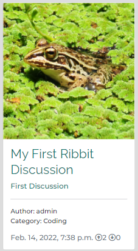

# Ribbit online Discussion forum

[View the live project here.](https://ribbit-2022.herokuapp.com/)

## User Experience (UX)

### As a site user:
* I want to be able to ready discussion and comments
* I want to be able to filter by a catagory

### As a registered site user:
* I want to be able to create my own discussions
* I want to be able to comment on other discussions
* I want to be able to edit my discussions
* I want to be able to delete my discussions
* I want to be able to edit or delete my comments

### As the site admin in need to:
* Be able to manage all discussions and comments
* Be able to update discussions, comments and categories
* Be able to add futher categories
* Be able to delete discussions, comments, categories and users

* ## Design 

    * ### Imagery
        * As images are able to be uploaded, by registered users, 
        there is no theme, or stlye however if a user doesn't choose an images\
        a basic frog is displayed to fill the space.

    * ### Colour Scheme
        * I used a mix of green throughout the page to stick with the theme
        of a frog(Hence the name Ribbit)

        

    * ### Typography 
        * For my body and p elements, I used: [Montserrat](https://fonts.google.com/specimen/Montserrat)
        with a weight of 500. As this is a clean and easie to read font

        * For the head emelents, I used: [Raleway](https://fonts.google.com/specimen/Raleway) with a 
        weight of 400 as this again was a clean font.

* ## Wireframes 

## Features

### Navigation:

#### Nav

* On the Nav bar you are able to go back to the home page, view by category and if you are signed in you can:
    * Create a new discussion and logout.
* If you aren't singed in you can login or sign up for an account.

#### Footer

* The footer doesn't change based on if you are signed or not, and contains links to social platforms and copyright.

### Home page (index.html):

#### Discussion cards

* The card is general information about the discussion, which contains:
    * featured image
    * title and exserpt
    * auhtor and category
    * date of creation and up and down votes
* The aim of the card is do give users an idea about the discussion before they click
on it.

#### Pagination

* The page paginate a 12 cards to stop user having to scroll for a long time.

### Opened discussion:

* At the top of the page is the title of the discussion
* Following this is is the feature image, if the user doesn't us a picture nothing will be displayed.
* After this is the generall information about the post like: author, creation, up and down votes.
* Next is the body/main area for the discussion.
* Last is the comment section, where you can read other peoples comments and comment your self.

###  Features Left to Implement

## Testing

### Web browers
* When testing in different browers I wanted to make sure all feature and style look and functioned the same. This is important so that the user can have the same expeerience on any different brower. I tested that the page opens and works in browsers: Chrome, Edge, Firefox,and Bing. To test the different browsers I used my computer to test Chrome, Edge, Firefox, and bing

### Responsiveness

### Validator Testing

* HTML
    * No errors were found when passing through the [official W3C validator](https://validator.w3.org/#validate_by_input).

    

* CSS
    * No errors were found when passing through the [official (Jigsaw) validator](https://jigsaw.w3.org/css-validator/#validate_by_input).

    

* Javascript
    * No errors were found when passing through the [JSHint validator](https://jshint.com/).

    

* Accessibility
    * I used lighthouse to confirm the site accessibility was 100%.

    

### Fixed Bugs 

### Unfixed Bugs

## Technologies Used

### Languages Used
* [HTML5](https://en.wikipedia.org/wiki/HTML5)
* [CSS3](https://en.wikipedia.org/wiki/CSS)
* [Javascript](https://en.wikipedia.org/wiki/JavaScript)
* [Python](https://www.python.org/)

### Framework, Libraries and Programs used

* [Balsamiq](https://balsamiq.com/wireframes/):
    * Used to create wireframes in the desgin process.
* [Google Fonts](https://fonts.google.com/):
    * 
* [Font Awesome](https://fontawesome.com/):
    * Used for the social media links in the footer.

## Deployment

### Heroku App

### Forking the GitHub Repository

Forking the repository allows us to have a copy of the original repository to view and make changes on our GitHub account with affecting to original work. Forking a repository can be done with the following steps.

1. Log in to GitHub and locate the [GitHub Repository](https://github.com/)
2. At the top right of the repository above settings, find and click the fork button. 
3. You will now have a copy in your account.

## Credits

### Code 
* 
* [W3Schools](https://www.w3schools.com/) use for help with audio sounds.

### Acknowledgements

* My Mentor for feedback throughout the project.
* Friends and family for help with testing and feedback